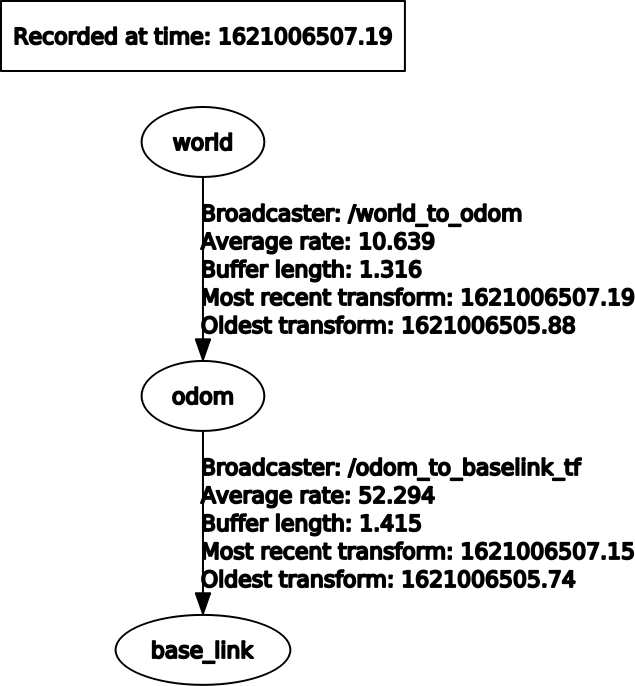
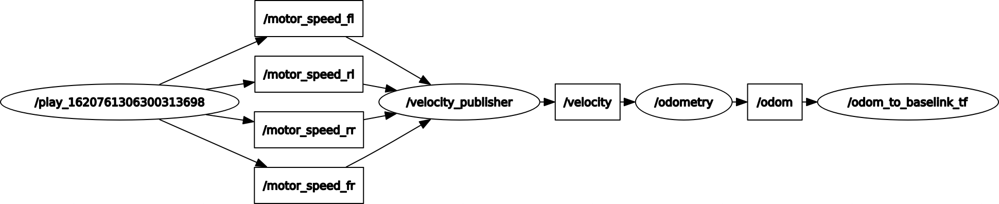
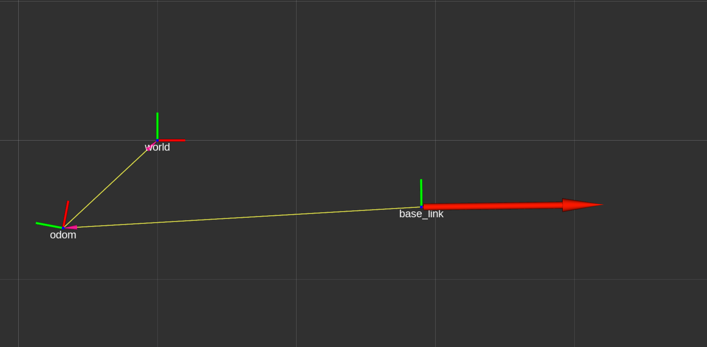
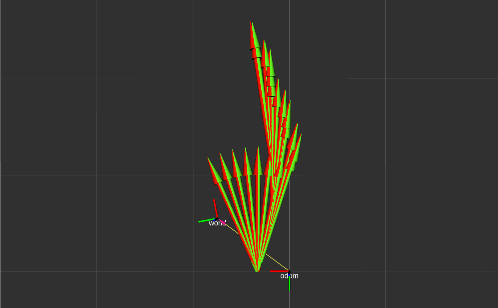

# Scout odometry


First project for the Robotics course at Politecnico di Milano, A.Y. 2020/2021.


***


## General details

[Scout 2.0](https://www.agilex.ai/index/product/id/2) is an indoor and outdoor mobile platform, dedicated to the development of multiple applications in higher education, research and industry.

In this project we are given some recorded data about the robot: speed of the 4 motors, odometry provided by the manufacturer and the ground truth pose of the robot acquired with [OptiTrack](https://www.optitrack.com/applications/robotics).

Using Robot Operating System (ROS) we have pursued are the following goals:
- compute odometry using skid steering approximated kinematics;
- use dynamic reconfigure to select between integration methods (Euler/Runge-Kutta);
- write 2 services to reset the odometry to (0,0,0) or to a certain pose (x,y,θ)
- publish a custom message with odometry value and type of integration.


***


## Structure of the project

```text
scout_odometry
└── src
    ├── CMakeLists.txt
    ├── project1
    │   ├── cfg
    │   │   └── integration.cfg
    │   ├── CMakeLists.txt
    │   ├── include
    │   │   └── project1
    │   │       └── robot_constants.h
    │   ├── launch
    │   │   └── launcher.launch
    │   ├── msg
    │   │   └── CustomMessage.msg
    │   ├── package.xml
    │   ├── rviz
    │   │   ├── odom_gtpose_comparison.rviz
    │   │   └── odom_to_baselink.rviz
    │   ├── src
    │   │   ├── odometry.cpp
    │   │   ├── odom_to_baselink_tf.cpp
    │   │   ├── reset_pose_client.cpp
    │   │   ├── set_pose_client.cpp
    │   │   ├── setup_calibration.cpp
    │   │   └── velocity_publisher.cpp
    │   └── srv
    │       ├── ResetPoseService.srv
    │       └── SetPoseService.srv
    └── robotics_hw1
        ├── CMakeLists.txt
        ├── msg
        │   └── MotorSpeed.msg
        └── package.xml
```


***


## Description of the files

| File | Description |
| :--- |:--- |
| integration.cfg | Python configuration file containing the enum for the choice of the integration method. |
| robot_constants.h | Header file containing constant values associated to the specific robot. |
| launcher.launch | ROS launcher file starting nodes and two rviz instances. |
| CustomMessage.msg | Custom message containing odometry and integration method (   required by the specification). |
| odom_gtpose_comparison.rviz | Rviz configuration file containing settings to show the comparison between `/odom` and `/gt_pose`. |
| odom_to_baselink.rviz | Rviz configuration file containing settings to show the *tf* from `odom` frame to `base_link` frame. |
| odometry.cpp | ROS node which computes the odometry and acts as a server for both the services and the dynamic reconfigure. |
| odom_to_baselink_tf.cpp |ROS node which computes the *tf* from `odom` frame to `base_link` frame. |
| reset_pose_client.cpp | ROS node implementing the client for resetting the pose of the robot to (0,0,0). |
| set_pose_client.cpp | ROS node implementing the client for setting the pose of the robot to arbitrary values specified by the user. |
| setup_calibration.cpp | Ros node to be launched standalone once for computing `GEAR_RATIO` and `APPARENT_BASELINE`. |
| velocity_publisher.cpp | ROS node which synchronizes the `MotorSpeed.msg` messages and publishes the robot velocity on the `/velocity` topic. |
| ResetPoseService.srv | (Empty) description file for the `reset_pose_service` service. |
| SetPoseService.srv | Description file for the `set_pose_service` service. |
| MotorSpeed.msg | Message containing the rpm of a motor. |


***


## ROS parameters

Inside `launcher.launch` we use the following 6 parameters to define the initial pose, whose values have been extrapolated from the *.bag1* file.

| File | Description |
| :--- |:--- |
| initial_pose_x | Cartesian coordinate of the initial pose along the x-axis. |
| initial_pose_y | Cartesian coordinate of the initial pose along the y-axis. |
| initial_pose_orientation | Yaw angle (in radians) of the initial pose. |


***


## TF tree

We have implemented a dynamic transformation in *odom_to_baselink_tf.cpp* to move from the `odom` frame to the `base_link` frame. In such a way we can see how the odometry is fixed with respect to `base_link`, while the latter is mobile with respect to `odom`.

As shown in the image below, the idea is: *(world -->) odom --> base_link*




***


## Custom message

The custom message we publish follows the structure contained in the project specification:

```
nav_msgs/Odometry odom
std_msgs/String method
```

where `method` specifies the type of used integration ("Euler" or "RK") and `odom` is the message with the odometry we computed earlier.


***


## How to start and use the nodes

Compile with catkin:
```console
catkin_make
```

If you are executing this project for the first time, then you could want to run the `setup_calibration` node and the `bag1.bag` file:
```console
rosrun project1 setup_calibration
rosbag play bag1.bag
```
This way, letting the node run for some time (the more the better), the approximated values of the computed gear ratio and of the computed apparent baseline will be shown on the screen. In case you use a different skid-steering robot, rather than Scout 2.0, such values can be written by hand into the `robot_constants.h` file. Otherwise you will find the already computed ones right there.

At this point you can run the *.launch* file:
```console
roslaunch launcher.launch
```

Last thing to do is running one of the *.bag* files:
```console
rosbag play bag1.bag
```

At the end of these steps you will have two running instances of `rviz`, an `rqt_reconfigure` window and the following three nodes executing in background:
- `velocity_publisher`
- `odometry`
- `odom_to_baselink_tf`

The `velocity_publisher` node contains one publisher and four subscribers. The subscribers subscribe to the topics (`/motor_speed_fl`, `/motor_speed_rl`, `/motor_speed_rr` and `/motor_speed_fr`) where the rpm of the motors are published. Those messages get synchronized and processed in order to obtain both the linear and the angular velocities of the robot, which are then published by the publisher inside a *TwistStamped* message on the `/velocity` topic.



The `odometry` node contains a publisher and a subscriber too. Once a message has been published on the `/velocity` topic, the subscriber to that topic computes the Euler/Runge-Kutta integration starting from an initial pose specified through the parameters in the launch file. Then it calls for the publisher to publish the results of the integration into an *Odometry* message on the `/odom` topic. The publisher also publishes the custom message on the `/custom_topic` topic.

Other three functionalities implemented by the `odometry` node are the following:
- the `reset_pose_service` service, which is used in combination of the `ResetPoseService.srv` file to set the pose of the robot to (0,0,0);
- the `set_pose_service` service, which is used in combination of the `SetPoseService.srv` file to set the pose of the robot to certain values (x,y,θ) specified by the user;
- the dynamic reconfigure of the integration method, which is represented by an enum defined inside the `integration.cfg` file.

Please note that the two services make use of two dummy clients (`reset_pose_client` and `set_pose_client`) whose only purpose is to fill the eventual fields of the *.srv* files.

Last, but not least, the `odom_to_baselink_tf` node computes the *tf* from the `odom` frame to the `base_link` frame as specified in the section about the TF tree.


***


## Others

We also implemented a simple *static tf* from `world` to `odom` in order to compare our odometry with the ground truth pose recorded by the OptiTrack. The values we used have been collected once the OptiTrack data becomes stable.  

Below you can see a screenshot from the *odom_gtpose_comparison* rviz instance and another screenshot from the *odom_to_baselink* rviz instance:






***


## Group members

- Leonardo Gargani
- Alberto Maggioli
- Lorenzo Poretti

